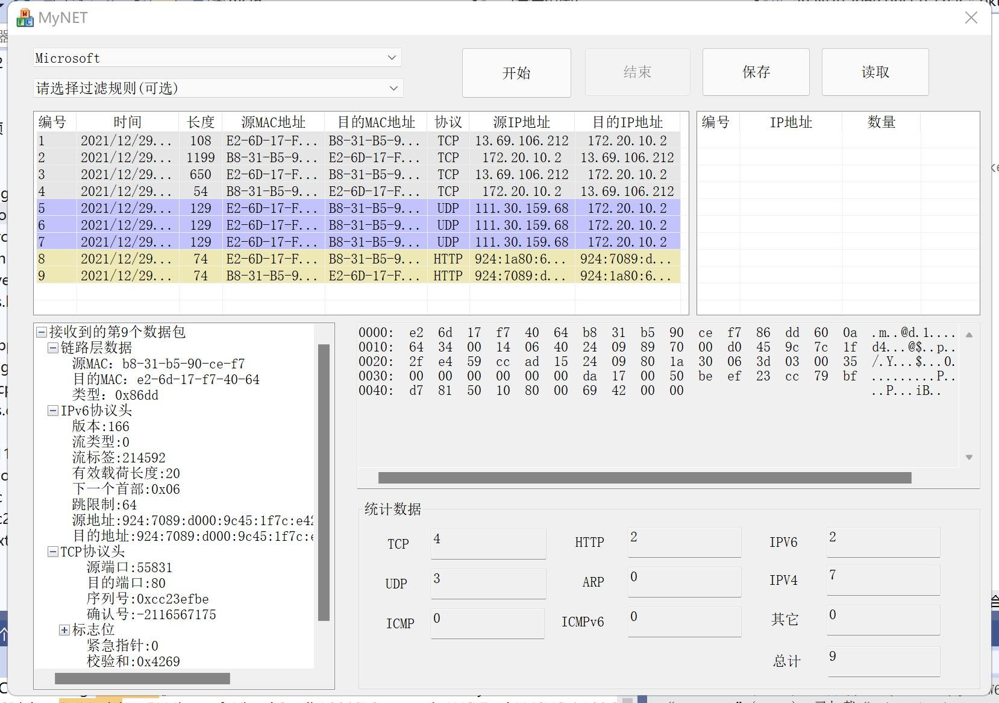
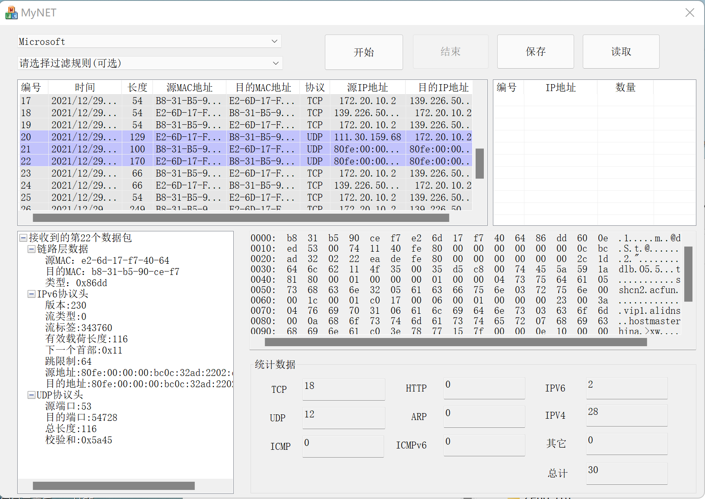
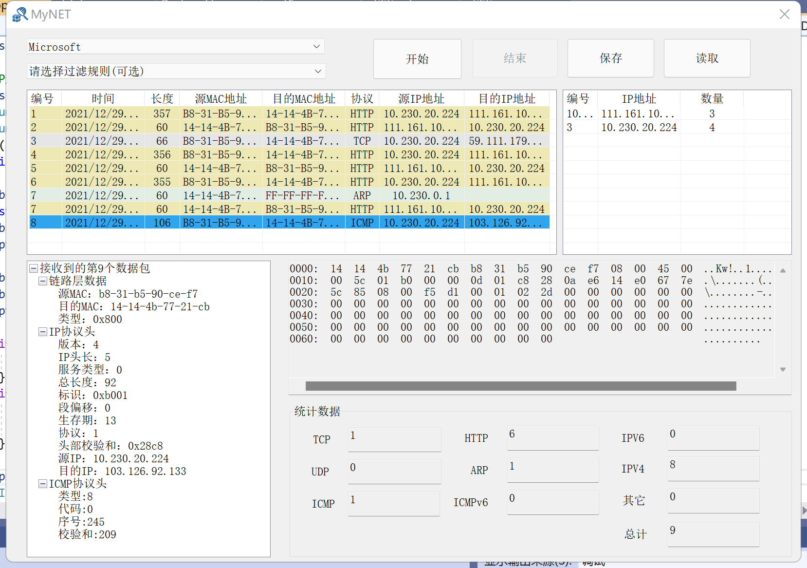
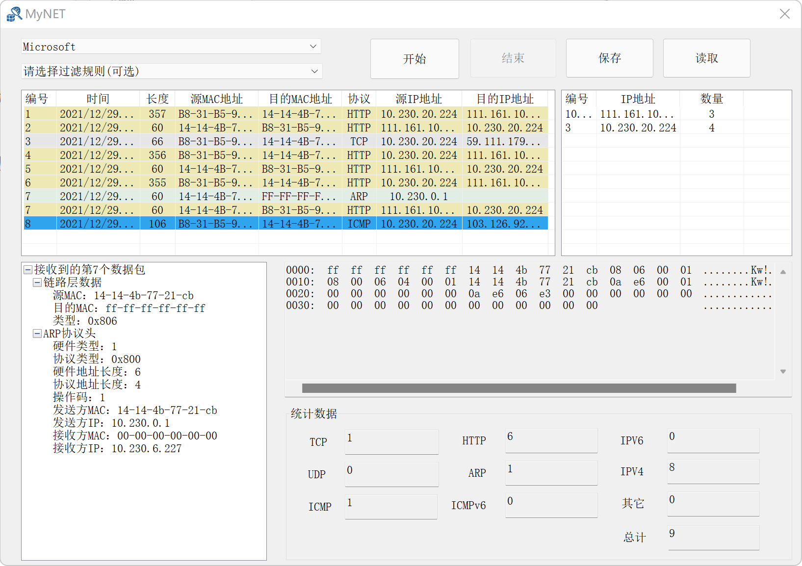
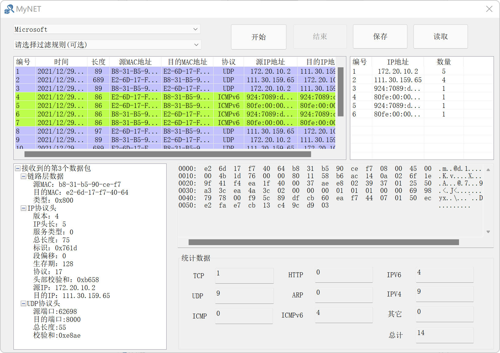
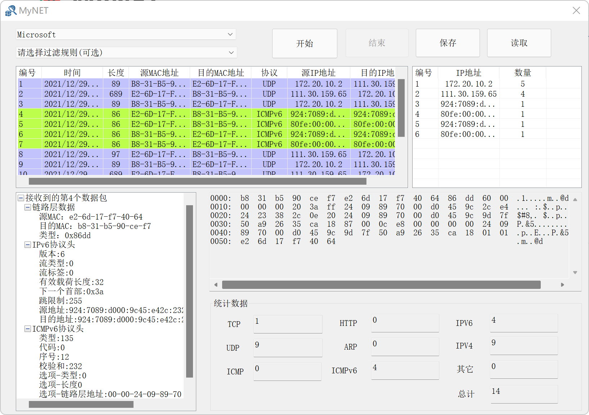

  <h1>🍉MyNET</h1>

这是一款基于MFC和WinPcap库开发的网络抓包和协议分析软件，你可以用它来采集本机网络流量并在线分析协议，或者读取pcap文件进行离线协议分析，快下载试试吧。

开发环境：Win11 + Visual Studio 2019 + mfc 
依赖：WinPcap 4.1.3 + WpdPack 4.1.2  

技术细节：

- MFC 搭建前端界面
- WinPcap 实现本地网络接口抓包
- 实现多种网络协议解析器

## 功能

* 本地网络接口上数据包实时捕获与在线协议分析
* 提供pcap文件存储
* 支持pcap文件读取与离线协议分析
* 提供显示过滤器，选择指定协议的数据包进行显示
* 支持常见网络协议解析  

  | 层次 | 协议 |
  | ------------------ | -----|
  | 应用层             | HTTP |
  | 传输层             | UDP / TCP |
  | 网络层             | IPv4 / ICMP / IPv6 / ICMPv6 |
  | 数据链路层         | ARP / MAC |
  
  
  | ICMP报文类型 | ICMP报文类型值 | 支持解析 |
  | ------------ | -------------- | -------- |
  | 目的地不可达 | 3              | ×      |
  | 源端抑制     | 4              | ×        |
  | 重定向       | 5              | ×        |
  | 超时         | 11             | ×        |
  | Echo请求     | 8              | ×        |
  | Echo响应     | 0              | ×        |
  
  
  | DNS资源记录类型 | 作用                        | 支持解析 |
  | --------------- | --------------------------- | -------- |
  | A               | 根据域名查询IP地址          | ×        |
  | NS              | 指定一个DNS服务器解析该域名 | ×        |
  | CNAME           | 查询域名的别名              | ×        |
  | PTR             | 根据IP地址查询域名          | ×        |
  
  
  | DHCP报文选项   | DHCP报文选项代码 | 支持解析 |
  | -------------- | ---------------- | -------- |
  | 填充           | 0                | ×        |
  | 子网掩码       | 1                | ×        |
  | 网关地址       | 3                | ×        |
  | DNS服务器地址  | 6                | ×        |
  | 域名           | 12               | ×        |
  | 请求IP地址     | 50               | ×        |
  | IP地址租约时间 | 51               | ×        |
  | DHCP消息类型   | 53               | ×        |
  | DHCP服务器标识 | 54               | ×        |
  | 厂商标识       | 60               | ×        |
  | 客户端标识     | 61               | ×        |
  | 结束           | 255              | ×        |
  

## 运行截图

### v1.0

* HTTP协议解析

* IPv6协议解析

* ICMP协议解析

  

  

* ARP协议解析

  

* TCP协议解析

  

* UDP协议解析

  

* ICMP协议解析

  

* ICMPv6协议解析

  

## 更新说明

* 2021/12/28 - 2021/12/29
  * 完成v1.0开发
  * 实现数据包实时捕获、IP监听和常见协议解析
  
## ToDoList  
- [ ] v2.0中DHCP,DNS等协议解析的实现  
- [ ] 数据包保存为.pcap格式文件
- [x] 实现IP数据报的监听  
- [x] ARP协议
- [ ] 数据报发送功能
- [ ] 实现端口扫描
- [ ] 导出为可执行文件.exe
- [ ] IP监听部分代码分离

## Known Issues
- [ ] 设计模式有些问题，没有合适的地方`free data.`

- [ ] 程序运行不久后会出发断点 [参考1](https://blog.csdn.net/qq_32716885/article/details/72910131?ops_request_misc=%257B%2522request%255Fid%2522%253A%2522164070078116780264083075%2522%252C%2522scm%2522%253A%252220140713.130102334..%2522%257D&request_id=164070078116780264083075&biz_id=0&utm_medium=distribute.pc_search_result.none-task-blog-2~all~sobaiduend~default-1-72910131.first_rank_v2_pc_rank_v29&utm_term=INT_PTR+nResponse+%3D+dlg.DoModal%28%29&spm=1018.2226.3001.4187)

## 参考资料

* [一步一步开发sniffer（Winpcap+MFC）（一）工欲善其事，必先配环境——配置winpcap开发环境](https://blog.csdn.net/litingli/article/details/5950962)
* [一步一步开发sniffer（Winpcap+MFC）（二）掀起你的盖头来，让我来画你的脸——用MFC开发GUI](https://blog.csdn.net/litingli/article/details/6098654)
* [一步一步开发sniffer（Winpcap+MFC）（三）安得广厦千万间，先画蓝图再砌砖——搭建winpcap抓包框架](https://blog.csdn.net/litingli/article/details/7315699)
* [一步一步开发sniffer（Winpcap+MFC）（四）要想从此过，留下协议头——各层网络协议头的实现](https://blog.csdn.net/litingli/article/details/7315789)
* [一步一步开发sniffer（Winpcap+MFC）（五）莫道无人能识君，其实我懂你的心——解析数据包](https://blog.csdn.net/litingli/article/details/7315914)
* [一步一步开发sniffer（Winpcap+MFC）（六）千呼万唤始出来，不抱琵琶也露面——将解析数据写到GUI上](https://blog.csdn.net/litingli/article/details/7316173)
* [WinPcap 4.0.1中文技术文档](http://www.ferrisxu.com/WinPcap/html/index.html)
* [1184893257/SimpleSniffer](https://github.com/1184893257/SimpleSniffer)
* [Chentingz/SnifferUI](https://github.com/Chentingz/SnifferUI)

